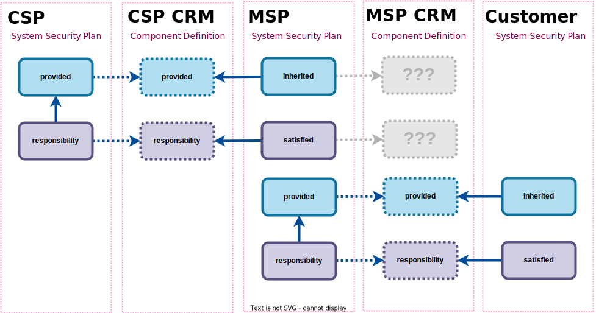

<!-- _paginate: skip -->
<!-- _class: intro -->

---

# Agenda

- The Patterns
- The Assemblies
- The Examples


---

<!-- _paginate: skip -->
<!-- _class: topic -->

# The Responsibility Pattern

---

# Basic Pattern


---

# CRM Sharing Pattern




---

<!-- _paginate: skip -->
<!-- _class: topic -->

# SSP Assemblies

---

<!-- _class: code reference -->

# System Security Plan

- Exportable flag (attribute) on:
    - `implementation-status`
    - assemblies
- Added `provided` outside of export.
- Added `responsibility` outside of export


```diff
===========================================
sysetm-security-plan:
    control-implementation:
        implemented-requirements:
            by-components:
===========================================
implementation-status [0 or 1]: {
++    exportable [0 or 1]: boolean,
}

inherited [0 or 1]: [
    An array of inherited object [1] {
    }
],

satisfied [0 or 1]: [
    An array of satisfied object [1] {
    }
],

++provided [0 or 1]: [
    An array of provided object [1] {
    }
],

++responsibility [0 or 1]: [
    An array of responsibility object [1] {
    }
],
```

---

# System Security Plan
<!-- _class: figure -->

## Rendered Example


---

<!-- _paginate: skip -->
<!-- _class: topic -->

# CDef Assemblies

---

<!-- _class: code reference -->

# Component Definition

- Exportable flag (attribute) on:
    - `implementation-status`
    - assemblies
- Added `provided` outside of export.
- Added `responsibility` outside of export


```diff
===========================================
component-definition:
    components:
        control-implementations:
            implemented-requirements:
===========================================
implementation-status [0 or 1]: {
++    exportable [0 or 1]: boolean,
}

++inherited [0 or 1]: [
    An array of inherited object [1] {
    }
],

++satisfied [0 or 1]: [
    An array of satisfied object [1] {
    }
],

++provided [0 or 1]: [
    An array of provided object [1] {
    }
],

++responsibility [0 or 1]: [
    An array of responsibility object [1] {
    }
],
```

---

# Component Definition

<!-- _class: figure -->

## Rendered Example


---

<!-- _paginate: skip -->
<!-- _class: topic -->

# The Examples

---

# Applied Example #1

## Single Control, Fully Inherited


---

<!-- _class: full-screen -->


---

<!-- _class: full-screen -->


---

# Applied Example #2


---

<!-- _class: full-screen -->


---

<!-- _class: full-screen -->


---

<!-- _class: full-screen -->


---

# Feedback

## Contact us:

- oscal@nist.gov
- 
- 
- 

