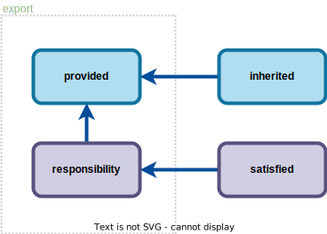

<!-- _paginate: skip -->
<!-- _class: intro disclaimer -->

### This presentation will be recorded.

---

<!-- _class: disclaimer -->

### This presentation will be recorded.
# OSCAL DEFINE

## Third Thursday of every month @ 11:00 AM ET

- Summarize current research efforts.
- Present findings from recent efforts.
- Gather feedback and input.
- **WILL NOT TAKE PLACE NOVEMBER AND DECEMBER**

> https://pages.nist.gov/OSCAL/contribute/define-meeting/

---

# Discussion is vital.

## Our goal is deeper understanding. Please help us to:

- **Ensure** that everyone feels welcome.
- **Encourage** sharing of individual perspectives and experiences.
- **Allow** everyone space to join in, as well as to finish speaking.
- **Ask** questions that expand ideas or uncover gaps.

---

# Research is essential.

## Our goal is better decision-making. We are seeking:

- **Problem Statements** as catalysts for the future of OSCAL.
- **Documentation** of concepts requiring thought and discovery. 
- **Feedback** as a contribution to the best approach or alternatives.
- **Time** to consider all input and to make informed decisions.

> Project Link: https://github.com/usnistgov/OSCAL-DEFINE

---

# Agenda

## Your feedback and input is encouraged!

- Shared Responsibility Status
- Future Meetings
- Discussion

### Today's Discussion
> https://github.com/usnistgov/OSCAL-DEFINE/discussions/40

---

# Future Meetings

- One more meeting in October, to resume in January.
- Will publish information in Discussions in [OSCAL-DEFINE project](https://github.com/usnistgov/OSCAL-DEFINE).
- `prototype-*` - Currently holds experimental models formulated via DEFINE.
- Expect to see prototypes [in the reference](https://pages.nist.gov/OSCAL-Reference/models/).


---

# Future Meetings

- Others are planning to pick up research efforts.
- Interest in submitting problem statements.
- Community question regarding a problem statement - will follow up next week.

---

# CRM Concerns Today

1. Patterns
2. Assemblies
3. Example
4. Mention: Identifier Propagation (UUIDs)
5. *(Not Today: Component Definition Purpose/Context)*
6. *(Not Today: Related Export/Not Export)*

---

<!-- _paginate: skip -->
<!-- _class: topic -->

# The Responsibility Pattern

---
<!-- _class: fill -->
# Basic Pattern (SSP)



---
<!-- _class: fill -->

# CRM Sharing Pattern


---

<!-- _paginate: skip -->
<!-- _class: topic -->

# SSP Assemblies

---

<!-- _class: code reference -->

# System Security Plan

- Exportable flag (attribute) on:
    - `implementation-status`
    - assemblies
- Added `provided` outside of export.
- Added `responsibility` outside of export


```diff
===========================================
sysetm-security-plan:
    control-implementation:
        implemented-requirements:
            by-components:
===========================================
implementation-status [0 or 1]: {
++    exportable [0 or 1]: boolean,
}

inherited [0 or 1]: [
    An array of inherited object [1] {
    }
],

satisfied [0 or 1]: [
    An array of satisfied object [1] {
    }
],

++provided [0 or 1]: [
    An array of provided object [1] {
    }
],

++responsibility [0 or 1]: [
    An array of responsibility object [1] {
    }
],
```

---

# System Security Plan
<!-- _class: figure -->

## Rendered Example


---

<!-- _paginate: skip -->
<!-- _class: topic -->

# CDef Assemblies

---

<!-- _class: code reference -->

# Component Definition

- Exportable flag (attribute) on:
    - `implementation-status`
    - assemblies
- Added `provided` outside of export.
- Added `responsibility` outside of export


```diff
===========================================
component-definition:
    components:
        control-implementations:
            implemented-requirements:
===========================================
++ implementation-status [0 or 1]: {
++    exportable [0 or 1]: boolean,
++ }

++inherited [0 or 1]: [
    An array of inherited object [1] {
    }
],

++satisfied [0 or 1]: [
    An array of satisfied object [1] {
    }
],

++provided [0 or 1]: [
    An array of provided object [1] {
    }
],

++responsibility [0 or 1]: [
    An array of responsibility object [1] {
    }
],
```

---

# Component Definition

<!-- _class: figure -->

## Rendered Example


---

<!-- _paginate: skip -->
<!-- _class: topic -->

# The Revised Pattern

---
<!-- _class: full-screen -->


---

<!-- _paginate: skip -->
<!-- _class: topic -->

# An Example

---

# Applied Example


---

# Simplification

## Control: Analyze Events

> Requirement: Analyze detected events.

- **Cloud Service Provider**
  - Analyze the network events.
- **Managed Service Provider**
  - Analyze the container events.
- **Application Owner**
  - Analyze the application events.


---

# And... (with Proprietary Info)

### Cloud Service Provider | Analyze the network events
  - PI: **Automated analysis** of patterns and characteristics of access and use.
  - **Access** dashboard for events.
  
### Managed Service Provider | Analyze the container events.
  - **Review** service provider network dashboard on daily basis.
  
### Application Owner | Analyze the application events.

---

<!-- _class: full-screen -->


---

# Discussion

## Contact us:

- oscal@nist.gov
- https://github.com/usnistgov/OSCAL-DEFINE/discussions

## What's Next

- Publish draft in the OSCAL Reference.
- Open period for feedback.
- Change requests submitted in OSCAL project.
- Next meeting October 19, 2023 - **will confirm about a week prior**.


