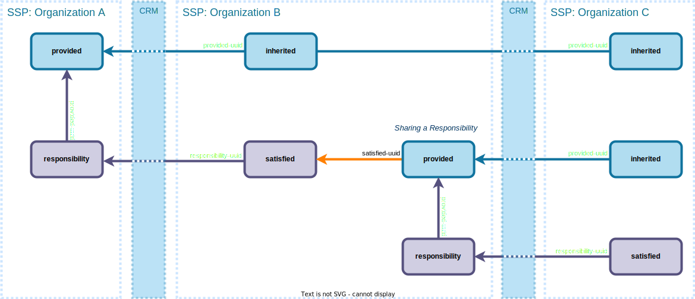
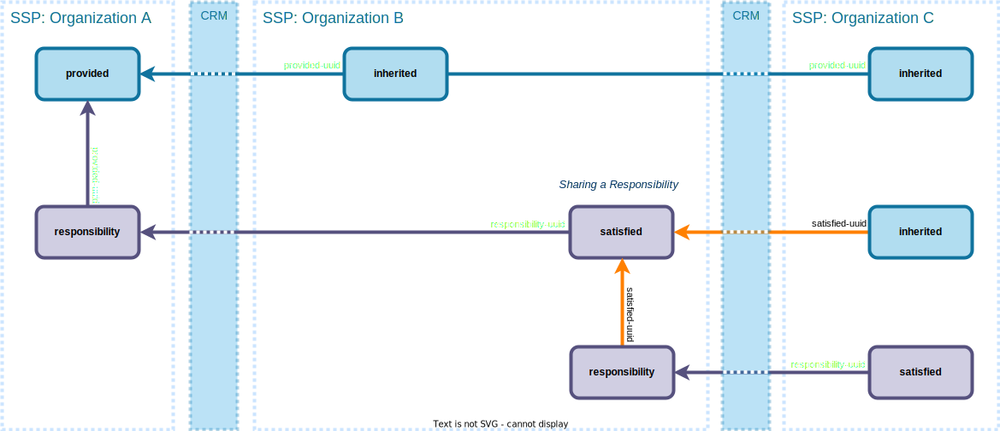

<!-- _paginate: skip -->
<!-- _class: intro disclaimer -->

### This presentation will be recorded.

---
<!-- _class: disclaimer -->

### This presentation will be recorded.
# OSCAL DEFINE

## Third Thursday of every month @ 11:00 AM ET

- Summarize current research efforts.
- Present findings from recent efforts.
- Gather feedback and input.
- **WILL NOT TAKE PLACE NOVEMBER AND DECEMBER**

> https://pages.nist.gov/OSCAL/contribute/define-meeting/

---
# Discussion is vital.

## Our goal is deeper understanding. Please help us to:

- **Ensure** that everyone feels welcome.
- **Encourage** sharing of individual perspectives and experiences.
- **Allow** everyone space to join in, as well as to finish speaking.
- **Ask** questions that expand ideas or uncover gaps.

---
# Research is essential.

## Our goal is better decision-making. We are seeking:

- **Problem Statements** as catalysts for the future of OSCAL.
- **Documentation** of concepts requiring thought and discovery. 
- **Feedback** as a contribution to the best approach or alternatives.
- **Time** to consider all input and to make informed decisions.

> Project Link: https://github.com/usnistgov/OSCAL-DEFINE

---
# Agenda

## Your feedback and input is encouraged!

- Future Meetings
- Prototype Models
- Discussion

### Today's Discussion
> https://github.com/usnistgov/OSCAL-DEFINE/discussions/42

---
# Future Meetings

- No meeting in November and December.
- Will publish information in Discussions in [OSCAL-DEFINE project](https://github.com/usnistgov/OSCAL-DEFINE).
- `prototype-*` - Currently holds experimental models formulated via DEFINE.
- Prototypes published [in the reference](https://pages.nist.gov/OSCAL-Reference/models/)!

---
<!-- _paginate: skip -->
<!-- _class: topic -->

# The Pattern *(Review)*

---
<!-- _class: fill -->
# Basic Pattern (SSP)

---
<!-- _paginate: skip -->
<!-- _class: topic -->

# The Revision *(Review)*

---
<!-- _class: fill -->
# With Provided Response

---
<!-- _class: fill -->
# Passing Satisfied Response

---
<!-- _paginate: skip -->
<!-- _class: topic -->

# Prototypes

---
# Mapping Prototype

- https://pages.nist.gov/OSCAL-Reference/models/prototype-mapping-model/
  - [Mapping Model](https://pages.nist.gov/OSCAL-Reference/models/prototype-mapping-model/mapping/)

---
# Responsibility Prototype

- https://pages.nist.gov/OSCAL-Reference/models/prototype-shared-responsibility-model/
  - [System Security Plan](https://pages.nist.gov/OSCAL-Reference/models/prototype-shared-responsibility-model/system-security-plan/)
  - [Component Definition](https://pages.nist.gov/OSCAL-Reference/models/prototype-shared-responsibility-model/component-definition/)

---
# What's Next

- Examples using the prototypes.
- Formulating names and allowed values.
- Considering backwards compatibility approaches.
- Testing content.

---
# Discussion

## Contact us:

- oscal@nist.gov
- https://github.com/usnistgov/OSCAL-DEFINE/discussions

