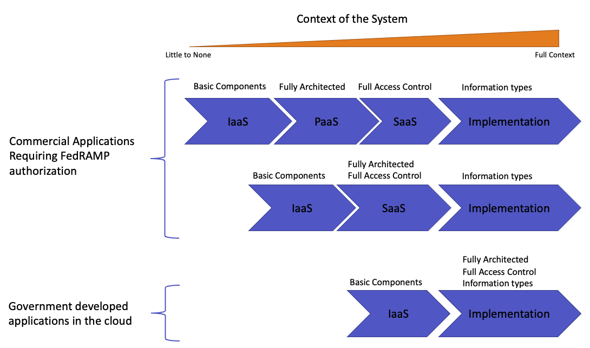
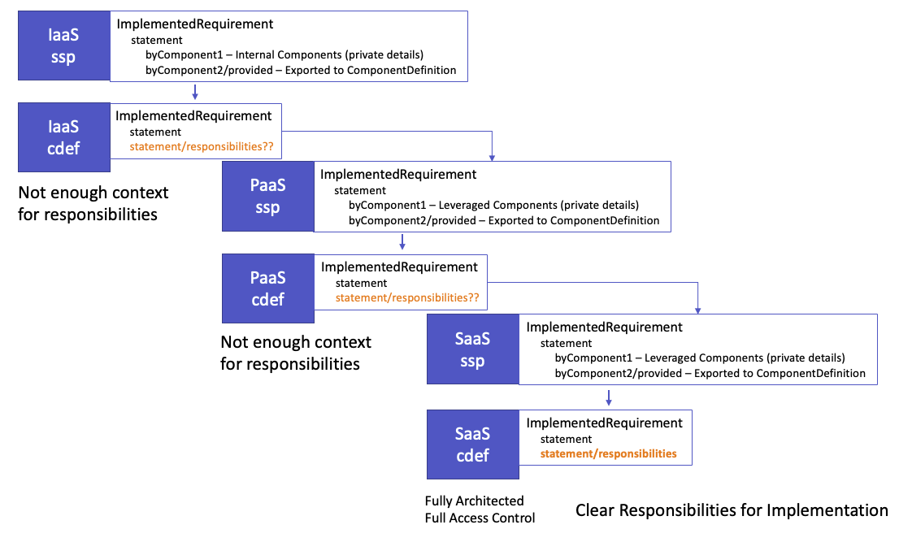
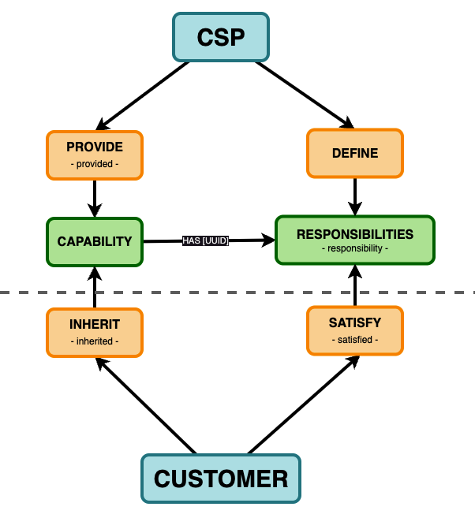
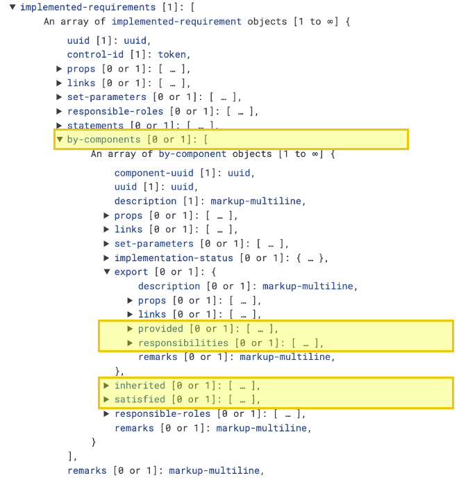

## Define: Customer Responsibility Model

## Problem

This spiral is focused on development of a draft customer responsibility model that can be used to inform implementation of the model in development.

| Element                         | Response                                             |
| ------------------------------- | ---------------------------------------------------- |
| Previous Spiral Sequence Number | [2023-03-08.003](2023-03-08.003.md)                  |
| Spiral Sequence Number          | [2023-05-01.004](2023-05-01.004.md)                  |
| GitHub Project Link             | https://github.com/usnistgov/OSCAL/                  |
| GitHub Issue #                  | [722](https://github.com/usnistgov/OSCAL/issues/722) |
| Author(s)                       | Chris Compton                             |
| Impact                          |                                                      |
| Criticality                     | Significant                                          |
| Scope                           | Project                                              |
| Audience                        | Service Providers and Security Practitioners         |

## Constraints

- May produce portions of a rendered model.
- Define assemblies required for the model.
- Provide documentation and requirements necessary to develop the model in metaschema.

## Requirements

- Produce enough detail to compose a change request for development.
- Include community participants where available to compose content for the model.
- Initiate a change request in the OSCAL project.

## Approach                    

- One-on-one interviews with community participants.
- Group conversations as required to address concerns and requirements.

## Participants

- Community volunteers (4 invited, 1 accepted)
- Valinder Mangat, CIO, DRT Strategies
# Discover

---

## Interview with Valinder Mangat (VM), May 1, 2023

Date: 5/2/2023

The recommendation is to use a Component Definition to serve as the mechanism to communicate shared responsibilities rather than create an entirely new model.  This approach has been explored by his team and appears to be a viable path with a few modifications to assemblies.

### A Crescendo of Context

> Crescendo of Context in Layered Systems [^fig-vm1]

The context of a system at the infrastructure level has minimal to no inherent context regarding the implementation and the data that will be stored in or traversing the system.  More context is revealed as each component of an architecture is composed to construct a platform, and ultimately deliver an application or service.[^vm]

This progression starts with a more objective, and somewhat synthetic, view of control implementation and adds subjective choices about the architecture of the system.  This necessitates a combination of controls, configurations, techniques and considerations related to the use of the system and the data handled within the system.  This contextual awareness impacts: 

- the evidence required, 
- the manner of documentation provided, 
- the responsibilities at each layer, 
- and how the controls are satisfied.

### The Full Realization of Responsibilities

> Clarity of Responsibilities in Layered Systems [^fig-vm2]

Similar to context, the clarity of responsibilities are likely to be difficult to fully specify at an infrastructure level without the context of the implementation.  On this basis, if responsibilities are a part of the infrastructure level documentation, they may not have enough detail to support implementation.[^vm]

### Many-to-One Problem

The use of Component Definitions (CDef) as a mechanism to export shared responsibilities has one issue that needs to be evaluated.  If multiple CDefs, as components of a system, are contained within an SSP, the exported CDef would require that statements be collapse (or concatenated) into a single statement.

[** TODO: GRAPHIC NEEDED - show multi-CDef to SSP to SR CDef **]

## Existing Benchmarks, Practices and Prior Art 

The current state of SSP model assemblies related to shared responsibilities is summarized below.

> SSP Model Responsibility-related Assemblies

The `by-components` assembly within the `System Security Plan` model supplies an `EXPORT:PROVIDED` element for a capabilty.  The same assembly supplies the `EXPORT:RESPONSIBILITIES` element to assign responsibilities associated with provided capabilities.

The `by-components` assembly within the `System Security Plan` model supplies also supplies `INHERITED` and `SATISFIED` assemblies for the customer to supply responses to capabilities that are provided and responsibilities that have been addressed.

Provided capabilities can be related to shared responsibilities using the `PROVIDED-UUID` element of the responsibilities assembly.

> SSP Model Outline

### Provided Definition

Describes a capability which may be inherited by a leveraging system.[^def-provided]

For example:
- Provider: “I have done X.” [Provided]
- Customer: “I’m accepting that you did X.” [Inherited]

### Responsibilities Definition

Describes a control implementation responsibility imposed on a leveraging system.[^def-responsibility]

For example:
- Provider: “You need to do X.” [Responsibilities]
- Customer: “I did X.” [Satisfied]

## Analysis

### Critical Elements

The following information will be REQUIRED to communicate capabilities provided, or a responsibilities shared:

1. Export: Provided
2. Export: Responsibilities
3. Responsibility: Responsible-Role
4. UUIDs from SSP related to Provided Capabilities
5. Originating SSP UUID
6. Implementation Status

### Export Assembly

Currently, an "export" assembly exists on the SSP model, but there is not a similar export assembly in the Component Definition that supports the provided capabilities, or responsibilities associated with the capabilities.

One argument for the absence of the export in the Component Definition is attributable to the lack of enough clarity and context to outline responsibilities if the Component Definition is providing information about an infrastructure or platform component.

### Considerations

The following are changes that should not be breaking to the 1.x version of OSCAL.

- Add the export assembly to the Component Definition.

The following changes will likely break the 1.x version of OSCAL.

- Rename export to shared-responsibility.
- Remove the export level description.

## Feasibility

`Content Here`

## Risks

`Content Here`

## Workarounds

`Content Here`

## Resources Required

`Content Here`

## Action 

`Content Here`

# Validation

## Workflow for Responsibility Modeling in OSCAL

1. CSP has `PROVIDED` a capability.
2. CSP explains what may be inherited in a description.
3. CSP defines the `RESPONSIBLE-ROLE` for inheriting.
4. CSP also defines the `RESPONSIBILITIY` associated with the `PROVIDED` capability.
5. CSP links the `RESPONSIBILITY` to the `PROVIDED` capability.
6. CUSTOMER will INHERIT as desired.
7. The CUSTOMER `INHERITED` description may be a verbatim copy from the CSP.
8. The `INHERITED` capability will be LINKED to the CSP by UUID from the CSP.
9. CUSTOMER will explain `SATISFACTION` of any `RESPONSIBILITY` associated with the `INHERITED` CAPABILITY.

# References

[^vm]: Interview with Valinder Mangat on May 1, 2023.
[^fig-vm1]: Fig 2. Slide Courtesy of Valinder Mangat.
[^fig-vm2]: Fig 2. Slide Courtesy of Valinder Mangat.

[^def-provided]: https://pages.nist.gov/OSCAL/reference/latest/system-security-plan/json-reference/#/system-security-plan/control-implementation/implemented-requirements/by-components/export/provided
[^def-responsibility]: https://pages.nist.gov/OSCAL/reference/latest/system-security-plan/json-reference/#/system-security-plan/control-implementation/implemented-requirements/by-components/export/responsibilities
