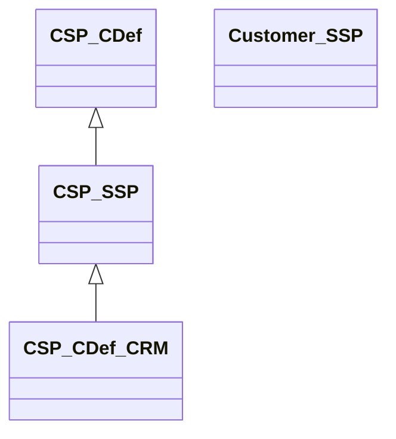

# Applied Example

## Single Control, Fully Inherited


---



    Class01 <|-- AveryLongClass : Cool
    Class03 *-- Class04
    Class05 o-- Class06
    Class07 .. Class08
    Class09 --> C2 : Where am i?
    Class09 --* C3
    Class09 --|> Class07
    Class07 : equals()
    Class07 : Object[] elementData
    Class01 : size()
    Class01 : int chimp
    Class01 : int gorilla
    Class08 <--> C2: Cool label
---

# CSP: OSCAL SSP

```yaml
      - uuid: NISTDEMO-CSP1-CTL1-0000-000000000000
        control-id: pe-11
        by-components:
        - uuid: NISTDEMO-CSP1-BYC1-0000-000000000000
          component-uuid: NISTDEMO-CSP1-CMP1-0000-000000000000
          description: |
            Emergency power is provided through multiple layers of battery backup, 
            and generator power capable of operating services indefinitely.
          implementation-status:
            exportable: true
            state: implemented
          provided:
            uuid: NISTDEMO-CSP1-PRO1-0000-000000000000
            exportable: true
            description: Emergency backup power is provided through the infrastructure for the customer.
```

---

# CSP: OSCAL CDef

```yaml
      - uuid: NISTDEMO-CSP1-CTL1-0000-000000000000
        control-id: pe-11
        implemented-requirements:
        - uuid: NISTDEMO-CSP1-BYC2-0000-000000000000
          component-uuid: NISTDEMO-CSP1-CMP1-0000-000000000000
          implementation-status:
            state: implemented
          provided:
            uuid: NISTDEMO-CSP1-PRO1-0000-000000000000
            description: Emergency backup power is provided through the infrastructure for the customer.
```


---

# Customer: OSCAL SSP

```yaml
      - uuid: NISTDEMO-CUS1-CTL1-0000-000000000000
        control-id: pe-11
        by-components:
        - uuid: NISTDEMO-CUS1-BYC1-0000-000000000000
          component-uuid: NISTDEMO-CSP1-BYC1-0000-000000000000
          description: Emergency backup power is provided through the infrastructure for the customer.
          inherited:
            uuid: NISTDEMO-CUS1-INH1-0000-000000000000
            provided-uuid: NISTDEMO-CSP1-PRO1-0000-000000000000
            description: This control is fully inherited from the Cloud Service Provider
```